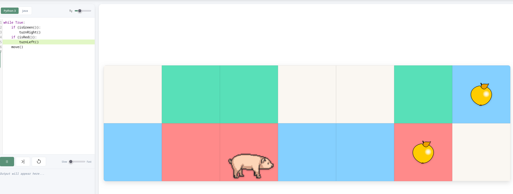

# Svinesti

An educational programming game that runs in the browser. Students write code to guide a pig around a colored grid, collecting apples. Two languages: Python 3 (via [Pyodide](https://pyodide.org/)) and a minimal Java-like language that transpiles to Python through an [ANTLR4](https://www.antlr.org/) parser.

It can be served by any static HTTP server, such as [Github Pages](https://tjstordalen.github.io/svinesti).
To run it locally you can, for instance, run `python -m http.server 8000` at the project root and open `http://localhost:8000` in your browser.
Opening the file `index.html` directly without an HTTP server will not work.
The first page load will take some time as it downloads the Pyodide runtime (~10 MB), after which it is cached by the browser.




## How It Works

From the perspective of the student, they write a program using the functions `move()`, `turn{Left,Right}()`, and `is{Red,Green,Blue}()`, click 'run', and watch the pig follow their instructions on the grid.
Under the hood, we append their code to a game engine that implements the above functions and run it in Pyodide.
The engine tracks each operation made and returns a 'trace', i.e., an array of events along with the line numbers
corresponding to those events. We then simulate the trace in Javascript,
animating the pig's movement and highlighting the lines as they 'execute'. This approach makes playing, pausing, single stepping, speed control, and rewinding trivial.

If the student writes in 'Java', we transpile it to Python and run it through the same pipeline. We have to take some care to map the lines in the generated program back to the original line numbers so we can simulate execution correctly.

The student's code drives the python program, so as a safeguard the engine kills the program after executing ten thousand lines of code, assuming that the submitted code loops infinitely. The last hundred or so events of the trace are simulated to show the student where it went wrong.

There is also a level editor so the student can make their own levels. It works directly on the level format — the character grid is the state, and the grid is fully redrawn on every change. The student can share levels via URL, or via a 'community levels server' hosted using Google Sheets and a simple AppScript server.

## The Transpiler

The 'Java' language (internally called PigJatin) supports `int`, `boolean`, `if/else`, `while`, and basic operators. No arrays, strings, classes, for loops, or user-defined functions. The transpiler does static analysis — type checking, scope resolution, unused expression detection — and tries to produce helpful error messages.

The ANTLR4 grammar is `src/PigJatin/PigJatin.g4`. Two visitors walk the parse tree: one for static analysis, one for code generation. If you modify the grammar, regenerate the parser using the command below and update the visitors to match.

```bash
antlr4 -Dlanguage=JavaScript -visitor src/PigJatin/PigJatin.g4 -o src/PigJatin/antlr
```

`src/PigJatin/testcases.txt` has ~900 test cases (generated by LLM and somewhat vetted by human) that stress test the static analysis visitor. The actual transpiler is tested through trial of fire (we deployed it).

## Project Structure
The three files at the heart of this are `game.js`, `python/worker.js`, and `python/svinesti.py` — they implement the core pipeline described above. `app.js` holds the shared state that the other modules import from. `config.js` has tunable values (timing, colors, messages); `constants.js` has strings that must stay in sync between JS and Python.

```
src/
  game.js              Runs code and replays event traces
  app.js               Central state and persistence
  main.js
  editor.js
  animations.js
  community.js
  sidebar.js
  grid.js              Grid factory shared by game, editor, and thumbnails
  config.js
  constants.js         Strings shared between JS and Python
  shortcuts.js
  levels.js
  names.js
  PigJatin/            Transpiler, grammar, and tests
    antlr/             Generated parser (do not hand-edit)
  appscript/           Google Apps Script backend

python/
  worker.js            Pyodide web worker
  svinesti.py          Game engine and event tracing

assets/
  css/
  icons/
  img/
  pigs/
```

## Level Format

```javascript
{
    name: "Level 4",
    nRows: 6,
    nCols: 10,
    grid: ["rrrrrrrrrr", "BbBbBbBbbb", "bBbBbBbBbb", "bbBbBbBbBb", "bbbBbBbBbB", "gggggggggg"],
    start: [5, 0],
    dir: "right"
}
```

Lowercase letters (r)ed, (g)reen, and (b)lue are colored tiles (the uppercase variants also have apples) and `.` is empty. Starting position is given as [row,column] and direction is "right", "down", "left", or "up". 

## External Dependencies

All loaded from CDNs — no npm, no bundler:

- [Pyodide](https://pyodide.org/) 0.28.1 — Python in WebAssembly
- [ANTLR4](https://www.antlr.org/) 4.13.2 — parser runtime
- [CodeMirror](https://codemirror.net/) 5.65.19 — code editor

---

# Licensing

Original work is licensed under [CC BY-NC-SA 4.0](https://creativecommons.org/licenses/by-nc-sa/4.0/). Third party work is licensed as follows.

## Pigs Rework
The "Pigs Rework" sprites are created by [AntumDelung at OpenGameArt.org](https://opengameart.org/content/pigs-rework) and licensed under the [Creative Commons Attribution 3.0](https://creativecommons.org/licenses/by/3.0/). They're based on the user [daneeklu's work "LPC Style Farm Animals submission"](https://opengameart.org/node/11629). The boar sprite is attributed to Jordan Irwin, and the original pig and piglet sprites are attributed to Daniel Eddeland.

CHANGES: cropped the individual pigs from the original sprite sheet.

## Pyodide
This project uses the [Pyodide project](https://github.com/pyodide/pyodide) to run Python code in the browser. Pyodide is licensed under the [Mozilla Public License 2.0](https://github.com/pyodide/pyodide/blob/main/LICENSE).

## Icons
The icons are from [Bootstrap Icons](https://icons.getbootstrap.com/) and licensed under the [MIT license](https://github.com/twbs/bootstrap/blob/v4.0.0/LICENSE)

## ANTLR4
The [ANTLR4 parser generator](https://www.antlr.org/) is licensed under the [BSD 3-Clause license](https://github.com/antlr/antlr4/blob/master/LICENSE.txt).

## CodeMirror
The [CodeMirror editor](https://codemirror.net/) is licensed under the [MIT license](https://github.com/codemirror/dev/blob/main/LICENSE).
